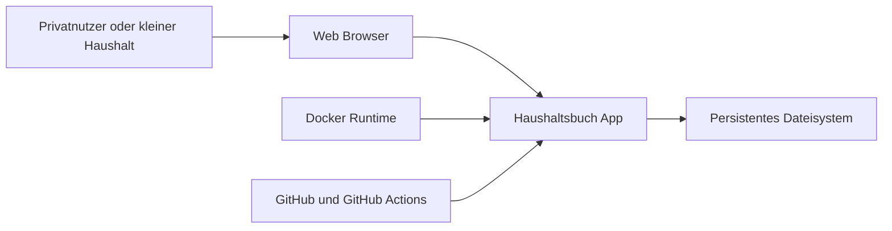
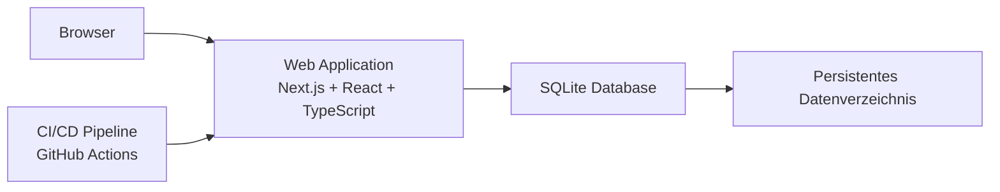
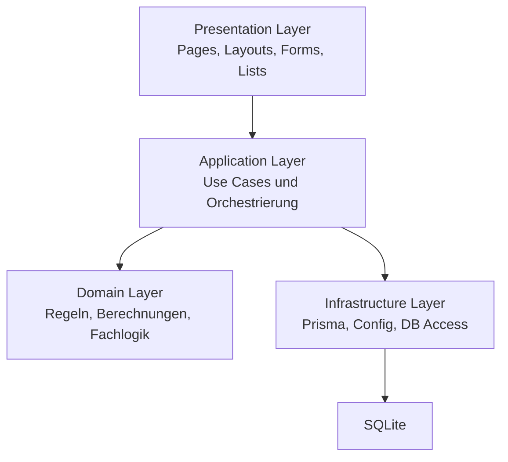
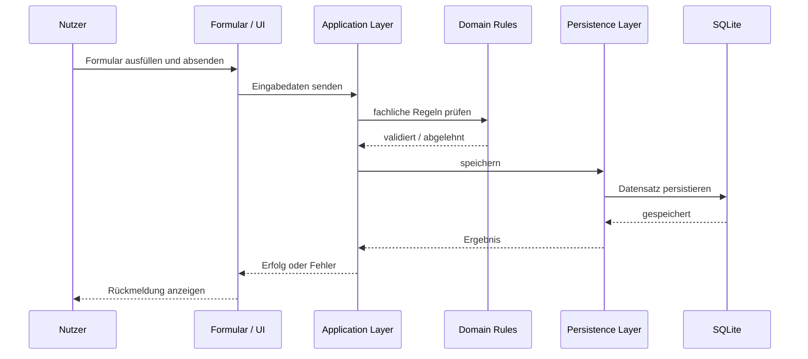
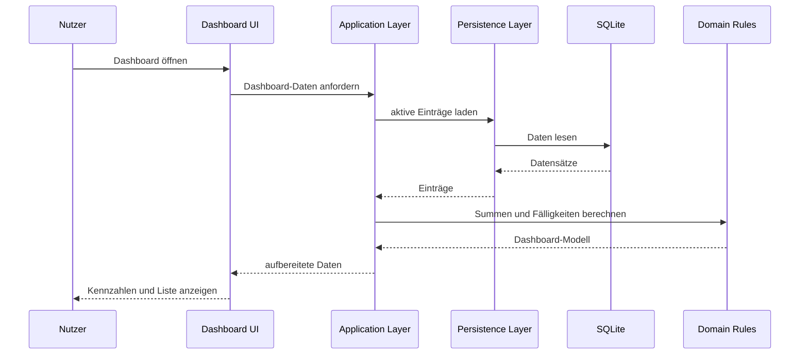
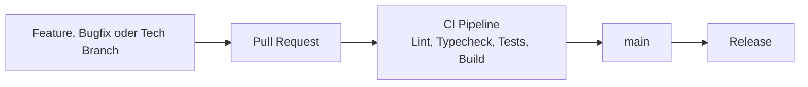

# Architecture Diagrams

Dieses Dokument ergänzt die Architektur um Mermaid-Diagramme, damit die Systemstruktur direkt im Repository visuell lesbar ist.

---

# 1. System Context

## Lesart
- Der Nutzer greift über den Browser auf die App zu.
- Die App läuft self-hosted, typischerweise in Docker.
- Persistente Daten liegen im Dateisystem, zunächst als SQLite-Datei.
- GitHub und GitHub Actions unterstützen Entwicklung, Qualität und Delivery.

---

# 2. Container View

## Lesart
- Die Web Application ist der zentrale Container des Systems.
- Die SQLite-Datenbank speichert die App-Daten.
- Das persistente Datenverzeichnis stellt sicher, dass Daten Container-Neustarts überleben.
- Die CI/CD-Pipeline prüft und sichert die Anwendung vor Merge und Release.

---

# 3. Component View, Web Application

## Lesart
- Die UI spricht nicht direkt mit der Datenbank.
- Die Application-Schicht steuert Use Cases.
- Die Domain-Schicht kapselt die Fachlogik.
- Die Infrastructure-Schicht verbindet die Anwendung mit Persistenz und Laufzeitdetails.

---

# 4. Use Case: Recurring Item anlegen

---

# 5. Use Case: Dashboard laden

---

# 6. Entwicklungs- und Qualitätsfluss

## Lesart
- Änderungen entstehen in dedizierten Branches.
- Merge läuft über Pull Request.
- CI ist das Qualitäts-Gate.
- `main` bleibt releasefähig.
- Releases bauen auf verifizierten Änderungen auf.

---

# 7. Architekturhinweis

Die Diagramme sind bewusst kompakt gehalten. Sie sollen:
- Orientierung geben
- die Schichtenregeln verankern
- neue Features leichter einordnen
- Architektur und Delivery zusammendenken
